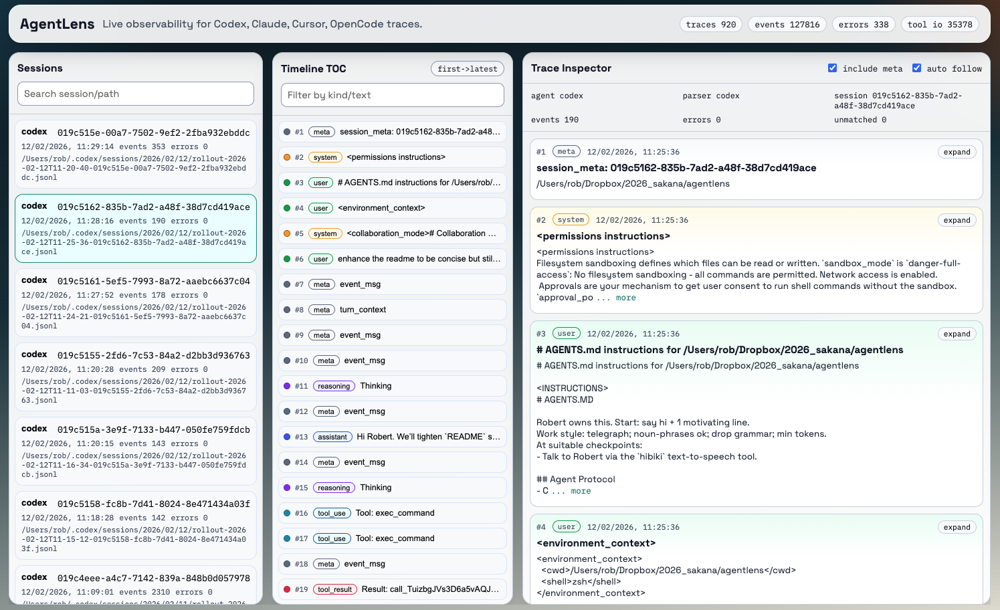

<p align="center">
  
</p>

<h1 align="center">AgentLens</h1>

<p align="center">
  <strong>Local observability for coding-agent sessions.</strong><br />
  Inspect Codex and Claude traces in a live web UI, CLI, and HTTP API.
</p>

<p align="center">
  
  
  
</p>



## Overview

AgentLens watches local session logs, normalizes events into a shared schema, and serves live inspection tools for debugging multi-agent workflows.

It is designed for local analysis: no hosted backend required.

## Key Capabilities

- Unified ingestion for Codex and Claude logs.
- Normalized event model across agents (`user`, `assistant`, `reasoning`, `tool_use`, `tool_result`, `meta`, `system`).
- Real-time stream updates for newly discovered traces and appended events.
- Deep tool-call visibility with argument/result text and unmatched tool I/O detection.
- Triage metrics out of the box: traces, sessions, events, errors, event-kind distribution, and top tools.
- Three interfaces over one core index: browser UI, CLI, and HTTP API.

## Activity Status Semantics

- Session `activityStatus` is computed in `@agentlens/core` and passed through unchanged to CLI/API/web.
- `waiting_input` is detected from structured markers first (status/type/phase-style fields), with text-pattern fallback.
- `running` is detected from unmatched `tool_use` events or very recent trace activity.
- `running` and `waiting_input` auto-degrade to `idle` after freshness TTL expiration.

TTL settings live in config under `scan`:

```toml
[scan]
statusRunningTtlMs = 300000
statusWaitingTtlMs = 900000
```

## Architecture

```text
Local agent logs (~/.codex, ~/.claude)
  -> @agentlens/core (discovery + parsing + indexing)
  -> @agentlens/server (Fastify API + SSE + static web hosting)
  -> apps/web (React UI) and apps/cli (terminal workflows)
```

## Quick Start

### Prerequisites

- Node.js 18+.
- npm (workspace-aware install/build/test flow).

### Option A: Run from source (no global install)

```bash
npm install
npm run build
node apps/cli/dist/main.js --browser
```

### Option B: Link `agentlens` globally from this repo

```bash
npm install
./build.sh
```

`build.sh` will:

- remove a conflicting global `agentlens` package (if installed),
- stop any existing AgentLens background server,
- build the full workspace (contracts/core/web/server/cli),
- `npm link` the local CLI,
- start `agentlens --browser`,
- open with a cache-busting URL (`/?reload=<timestamp>`).

Optional args are forwarded:

```bash
./build.sh --host 127.0.0.1 --port 8787
```

Note: `npm install -g agentlens` currently resolves to an unrelated registry package.

## CLI Reference

Common commands:

```bash
agentlens --browser
agentlens summary
agentlens summary --json --since 24h
agentlens sessions list --limit 20
agentlens session latest --show-tools
agentlens session <trace_id_or_session_id> --show-tools
agentlens sessions events latest --follow --jsonl
agentlens config get
agentlens config set scan.intervalSeconds 1.5
```

Useful patterns:

- Use `latest` for the most recently updated trace/session.
- Use `sessions events ... --follow` for live terminal streaming.
- Use JSON/JSONL flags (`--json`, `--jsonl`) for scripting pipelines.

## HTTP API

| Endpoint | Description |
| --- | --- |
| `GET /api/healthz` | Health check. |
| `GET /api/overview` | Aggregate counters and distributions. |
| `GET /api/traces?agent=<name>` | List indexed trace summaries, optionally filtered by agent. |
| `GET /api/trace/:id` | Paginated trace detail by trace id or session id. Supports `limit`, `before`, `include_meta`. |
| `GET /api/config` | Current merged runtime config. |
| `POST /api/config` | Update config, persist to disk, refresh index. |
| `GET /api/stream` | SSE feed (`snapshot`, `trace_*`, `events_appended`, `overview_updated`, `heartbeat`). |

## Configuration

Default config path:

```text
~/.agentlens/config.toml
```

Default explicit log roots:

```toml
sessionLogDirectories = [
  { directory = "~/.codex", logType = "codex" },
  { directory = "~/.claude", logType = "claude" }
]
```

Source profiles are configurable under `[sources.*]` (roots, include/exclude globs, scan depth, agent hints).

## Development

Run services in watch mode:

```bash
npm run dev:server
npm run dev:web
```

Open `http://127.0.0.1:5173` for frontend development (the Vite dev server proxies `/api` to `http://127.0.0.1:8787`).

Before review/merge, run full checks:

```bash
npm run build
npm run typecheck
npm test
```

## Monorepo Layout

```text
apps/cli        Published CLI (`agentlens`) and command handlers
apps/server     Fastify API + static web host
apps/web        React + Vite frontend
packages/core   Discovery, parsing, indexing, snapshots
packages/contracts Shared TypeScript contracts
```

## Runtime Files

- Server log: `~/.agentlens/logs/server.log`
- PID file: `~/.agentlens/server.pid`

## Agent Workflow Skill

If you use agentic workflows, see:

`skills/agentlens/SKILL.md`
