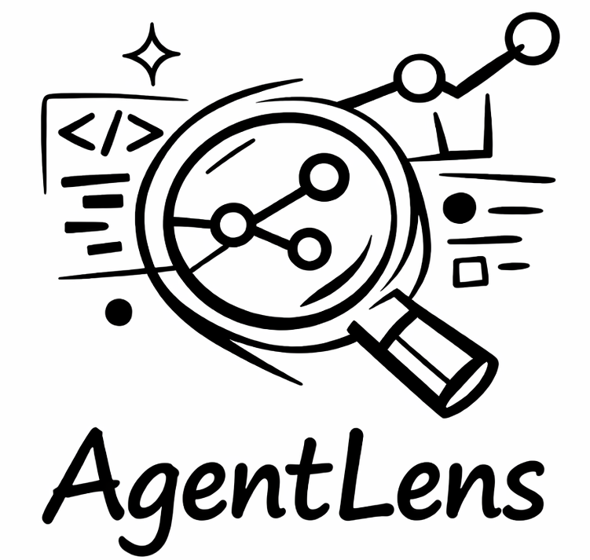
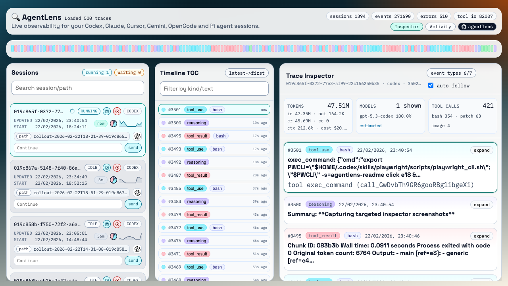
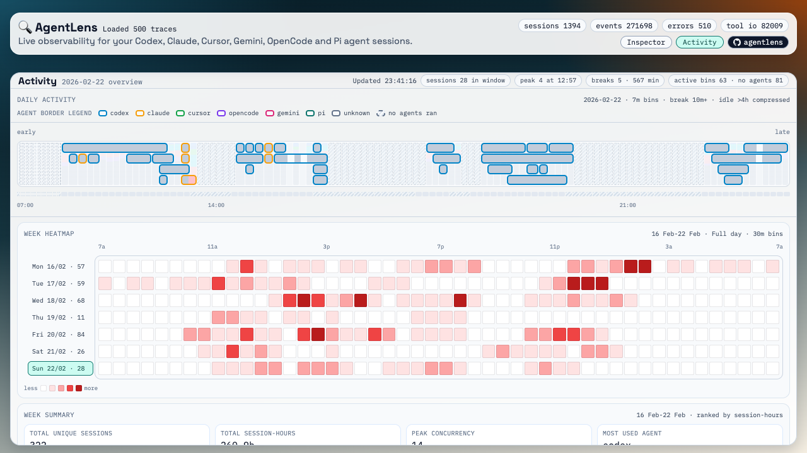

<p align="center">
  
</p>

<h1 align="center">AgentLens</h1>

<p align="center">
  Local observability for Codex, Claude, Cursor, Gemini, Pi, and OpenCode sessions.
</p>

<p align="center">
  
  
</p>

When agent workflows fail, most debugging time goes into piecing together scattered logs, tool calls, and session state. AgentLens gives you one local place to inspect traces live, compare sessions quickly, and jump from summary to event-level detail in seconds.





## Quick Start

### Fastest: run with `npx`

```bash
npx -y @roberttlange/agentlens --browser
```

### Install globally

```bash
npm install -g @roberttlange/agentlens
agentlens --browser
```

### From source

```bash
npm install
npm run build
node apps/cli/dist/main.js --browser
```

Then open `http://127.0.0.1:8787`.

### Remote tunnel helper

Use `scripts/agentlens-remote.sh` to launch AgentLens remotely and port-forward to local browser.
Use this when your agents run on a remote host: the script starts AgentLens on that host, indexes that host's trace files, and exposes it locally via the forwarded URL.
If sessions are missing, update source roots in the remote `~/.agentlens/config.toml`.

```bash
# GCP (explicit target)
./scripts/agentlens-remote.sh --connection gcp --zone <zone> --instance <login-vm>

# Generic SSH
./scripts/agentlens-remote.sh --connection ssh --ssh-base "ssh user@host"

# Stop remote AgentLens
./scripts/agentlens-remote.sh --kill --connection gcp --zone <zone> --instance <login-vm>
```

## 60-Second Usage

```bash
agentlens summary
agentlens sessions list --limit 50
agentlens session latest --show-tools
agentlens sessions events latest --follow --jsonl
```

Open the browser UI anytime:

```bash
agentlens --browser
```

## Direct Open: Any Local Trace File

Use a deep-link URL to open a specific log file immediately.

```bash
node -e 'const p=process.argv[1]; console.log(`http://localhost:8787/trace-file/${Buffer.from(p,"utf8").toString("base64url")}`)' "/absolute/path/to/trace.log"
```

## What You Get

- Unified ingestion for Codex, Claude, Cursor, Gemini, Pi, OpenCode.
- Live web UI + CLI + HTTP API on one local index.
- Session activity state (`running`, `waiting_input`, `idle`).
- Activity Overview in web UI:
  - `Daily Activity`: left-to-right timeline, stacked parallel sessions, pastel event coloring, idle-gap compression.
  - `Week Heatmap`: click a day label to load that day in `Daily Activity`.
- Tool call/result inspection, error visibility, and stream updates.

## Activity View



### How Activity Is Computed

- Session status:
  - `waiting_input`: explicit wait markers (plus text fallback).
  - `running`: unmatched tool call or recent activity inside running TTL.
  - `idle`: no active signal or TTL timeout.
- Timeline/heatmap bins are computed from timestamped events per session, split into active segments when gaps exceed 20 minutes.
- A bin is active when any segment overlaps it; AgentLens also counts events in that bin and derives dominant agent/event kind for coloring.
- `Daily Activity` uses a local `07:00 -> next 07:00` window (today truncates at `now`); `Week Heatmap` applies the same binning across each selected day window.
- Breaks are contiguous zero-activity bins lasting at least `break_min` (default `10` minutes).

## Docs

- [Full reference](docs/reference.md): architecture, event model, status semantics, source defaults.
- [HTTP API](docs/api.md): endpoints, params, examples, SSE behavior.
- [Configuration](docs/configuration.md): config sections, practical defaults, tuning notes.
- [Development](docs/development.md): dev loop, workspace commands, verification gate.

## Monorepo Layout

```text
apps/cli          Published CLI (`agentlens`) and command handlers
apps/server       Fastify API + static web host
apps/web          React + Vite frontend
packages/core     Discovery, parsing, indexing, snapshots
packages/contracts Shared TypeScript contracts
```
